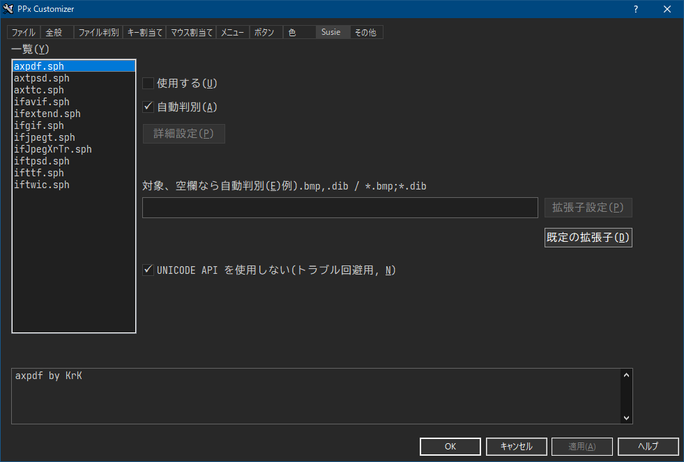

# PPx Customize Example

TORO氏作のファイラーPaper Plane xUIのカスタマイズ例です。

---

# Screen Shot


---

## このカスタマイズファイルの特長

- タブなし独立1画面による軽快な動作
- 目的別にまとめて管理できるタブ窓
- サブ窓（参照窓）を使って処理先を指定する方式のファイルコピー
- zoxideによるパス補完
- あらかじめ生成したディレクトリパスリストを使ってジャンプ   [Shift+G]
- everything search Engineを使って検索	          [W]メニューから選択
- あらかじめ生成した実行パスリストを使ってジャンプ 	  [Shift+X]
- スクリプト不使用。（今のところは）

---

## ファイル

- PPx_kuro_unicode_x64.CFG（カスタマイズファイル本体）
- PPx_color_xxxx.CFG（色設定ファイル（着せ替え用）
- font_example_XXX.cfg (フォント設定例)
- l_keyhelp.txt（キー操作一覧を[F1]キーで表示）
- key検討用\ppxkey.xlsx（キー操作検討・エイリアス登録している実行ファイル詳細）

---

## インストール

### ファイルのコピー

以下のファイル一式を必要に応じてPPxのインストールフォルダにコピーしてください。

フォルダ名が記載されているものに関してはサブフォルダを作ってそちらに入れてください。

**A）PPx 拡張モジュール**

- Message Module （PPxMES64.dll）
- CFX Module （PPxCFX64.dll）
- Text Module （PPxtext64.dll）
- Everything Search Module（PPXETP64.dll）
- Module Junk Parts（PPxjunk64.dll）
- Common Dialog Extender（PPDEX64.exe/PPDEX.exe）

**B）外部モジュール**

- bregonig.dll
- migemo.dll

**C）圧縮解凍ソフト**

- 7z.dll
- 7z.exe
- 7-zip64.dll
- RAR.exe (フォルダ：tools)
- UNRAR64.DLL
- UNRAR64J.DLL
- UNZZIP64.dll
- UNLHA32.dll
- CAB32.dll
- UNBYPASS.dll
- TAR64.dll
- unbypass.exe/unbypass.dll

**D）64bit Susieプラグイン**

- iftwic.sph
- ifjpegt.sph
- iftpsd.sph
- ifttf.sph
- ifextend.sph
- ifavif.sph
- axpdf.sph/pdfium.dll
- runsph.exe(PDFのサムネイル表示で必要)

**E）32bit Susieプラグイン（フォルダ：SPI）**

- ifcrw_t.spi（CANON CRW）
- ifdxfft.spi（DXF）
- ifdwg.spi（DWG）
- runspi.exe

**F）コマンドラインツール**

- xdoc2txt
  [V]キーで%ME_pagerの設定に従ってバイナリドキュメントファイルに含まれる
- テキストをPPv[A]で閲覧することが出来ます。
- zoxide（フォルダ:tools)
- es.exe（フォルダ:tools)
- exiftool（フォルダ:tools)
- busybox64u
- ripgrep（フォルダ:tools)
- ls2lf.exe（フォルダ:auxcmd）

**G）フォント**

**メインウィンドウ**

- Plemol JP ConsoleNFJ-medium (https://github.com/yuru7/PlemolJP)
- UDEV Gothic (https://github.com/yuru7/udev-gothic)
- ばぐまるゴシック (https://debugx.net/BugSoft.aspx?Soft=BugMaruGothic)

　※ちょっと太めのゼロ斜め線入りが個人的には好みです。

**一行編集・ダイアログ**

- Migu 1c (https://github.com/yuru7/udev-gothic)
- Nasu (https://itouhiro.hatenablog.com/entry/20140917/font)
- ばぐまるPゴシック (https://debugx.net/BugSoft.aspx?Soft=BugMaruGothic)

---

### カスタマイズファイルの読み込み方法

1. PPxフォルダーに実行ファイルと、関連ファイル一式を置きます。
2. PPx_kuro_unicode_x64.CFGおよび同階層にあるファイルとサブフォルダの内容をPPxフォルダーに配置します
3. PPx_kuro_unicode_x64.CFGの内容を読み込みます。

---

### 初期設定

**A） X_saveフォルダーの設定**

 **KC_mainのFIRSTEVENTに記述している設定にしたがって自動で作成されます。**

1. PPxインストールフォルダーがC:\program Files以下（たとえば、C:\Program Files\PPx）の場合

   X_save＝%'APPDATA'\TOROID\PPx\userdata

2. PPxインストールフォルダーがC:\program Files以外（ポータブルインストール）の場合

   X_save=（PPxインストールフォルダー）\userdata

となります。

X_saveフォルダにリストファイル保存用としてlistfileフォルダも作成されます。

**B）zoxideの設定**

zoxide.exeを（PPxインストールフォルダー）\tools以下に配置してください。

（デフォルト設定をそのまま使う場合）

独立窓PPc[A]起動時にzoxideのdb（db.zo）をPPxの補完候補として使える形式

（l_dirzoxide.txt）に変換するようにしています。

**C）Everythingの設定**

Everything Search Moduleをインストールすると、一行編集の補完リストにも

Everythingの検索結果がリストアップされますが、これはファイル・ディレクトリの種別なく

補完候補が挙がってきて使いにくいと思いますので、OFF（ETP_PART=0）にすることをお勧めします。

Everything Search Moduleの検索結果をリストアップしない代わりに、

実行ファイル専用の補完リスト（l_exeEverything.txt）と

ディレクトリ専用の補完リスト（l_dirEverything.txt）を

Everythingのコマンドライン版es.exe経由で作成し、専用の一行編集窓から補完リストを読み込んで

ジャンプする機能を作成しています。それぞれ、[Shift+Z][Shift+G]で呼び出すことが出来ます。

また実行ファイルのリストを使って[Shift＋X]キーで任意のプログラムからファイルを開けるようにもしています。

以下のように設定します。

1. メニュー　設定（&O）→ Everythingを最小化してバックグラウンドで特権実行
   →　EverythingのAdmin起動用としてタスクマネージャーに登録　メニューを選択すると
   EverythingAdminExecという名前（万が一既に存在するときは変更可能です）のサービスを登録する一行編集メニューが出ますので、「OK」を押してください。
2. メニュー　設定（&O）→ Everythingを最小化してバックグラウンドで特権実行
   →　EverythingのAdmin起動用としてタスクマネージャーを確認　メニューを選択すると
   以下のような表示が出てきたら設定は正しくできています。

   
3. EverythingのETPサーバ側に設定が必要です、図のように設定するとそのまま使えます。
   パスワードの初期値は「password」です。
   
4. PPxのCFGでは、以下のように設定しています。本体側の設定を変えるときは適宜書き換えてください。

```.js
  _User	= {
  ETP_FULL	= 10000
  ETP_PART	= 0
  ETP_PASS	= password
  ETP_PORT	= 23
  ETP_USER	= username
  EverythingAdminExec	= EverythingAdminExec
  }
```

[W]キーを押して、ファイル名検索（Everything）メニューを選ぶと
Everythingで検索するための一行編集窓が開きます。


「Fullp/Name(S)」ボタンは。検索対象を入力した後、検索対象となるドライブ/パスを

限定するためにツリーメニューで検索対象を絞り込むためのパスを入力するボタンです。

もう一度押すとパスは削除されます。トグル切り替えです。

サブ窓（参照窓）にこの一行編集窓を出してEverything検索結果一覧を出すこともできます。

ファイルhogeが存在するところと同じフォルダにコピーしたいときはコピー先に

ファイルhogeのパスをそのまま指定してもよく、ファイルの仕分け操作が捗ります。

**D)Susie Pluginの設定**

PDFのプレビューしたい場合はifextend.sphの拡張子にPDFを登録してください。

axpdf.sphは「使用する」のところをチェック外してください。PPxから直接呼び出さないだけでインストールは必要です。



**E） PPXUMASK.TXT PPXUPATH.TXT PPXUPATH.TXTの配置**

PPWXXXX.DATが存在するフォルダに配置します。このカスタマイズ（PPx_kuro_unicode.cfg）においてはX_saveで指定された

ディレクトリ(～\userdata)の1つ上位のディレクトリに配置することになります。

---

## カスタマイザー（PPCUSTW.exe）やメニューで設定できないところ

 **A) 以下の設定は起動時に初期化するためKC_mainのFIRSTEVENTに
     直接記述しています。**

```.js
FIRSTEVENT	,*setcust X_save=userdata %:*ifmatch /Program Files/,%0 %:*setcust X_save=%'APPDATA'\TOROID\PPx\userdata
	*makedir %*name(DC,%*getcust(X_save)\listfile,"%0") %m"X_saveで指定したディレクトリがなければ作成する。"
	*setsortentry &Z:名前数値順 %m"ソートは名前順で、数字桁が違っても数字の大小を認識する並びがデフォルト"
	*setmaskentry %m"起動時ファイルマスクをリセットする。"
	*ppvoption sync off %m"Shift+Yキーで開く連動ビューPPv[X]はONにして使用したあとOFFにし忘れて変な挙動になったとき連動ビューが原因だと気づきにくい。PPc起動時は必ずOFFにする。"
	*ifmatch !0,0%n# %: *viewstyle 保持設定({と}で調整)
	*ifmatch !0,0%n# %: *ifmatch !0,0%*getcust(S_memdirectory:%n) %:*jumppath %*getcust(S_memdirectory:%n)
	*ifmatch CA,%n %:*ifmatch "option:e,a:d-", %g'zoxide' %:*run -noppb -hide -nostartmsg zoxide query -l > "%*name(DCN,%*getcust(X_save),"%0")\l_dirZoxide.txt"
	*ifmatch CW,%n %:*viewstyle コメント
```

- X_saveディレクトリ（1行目）
- 起動時エントリの並び（3行目）
- 起動時ファイルマスクリセット（4行目）
- 起動時連動ビューOFF（5行目）
- タブ付窓起動時のエントリ表示設定（6行目）
- タブ付窓起動時の初期表示するエントリ（7行目）

  ※「.」（このディレクトリ）表示されたエントリ上でENTERを押して

  ディレクトリを記憶していたら次回起動時はそこを開きます。

  なお、記憶したディレクトリへは「INS」キーでジャンプできます。

  変更したい場合は、設定を適宜書き換えてください。

**B) 以下の設定は一行編集を閉じた後初期化するためKC_mainのACTIVEEVENTに
     直接記述しています。**

```.js
ACTIVEEVENT	,*setcust X_flst=3,1,0,300 %m"XC_flstのデフォルト値を設定。GUIで設定してもここの設定で書き換えられるので要注意！一行編集起動前に設定を変えてもACTIVEEVENT読み込み時リセットされるようにした。"
	*setcust XC_rmsk=1,1,0,0 %m"XC_rmskのデフォルト値を設定。GUIで設定してもここの設定で書き換えられるので要注意！"
	*ifmatch !CY,%n %:*setcust K_lied:REFBUTTON,*refsel
	*ifmatch !CX;!CY,%n %:*string u,temp_exec = %%I"PPc[X]起動後に他のPPcがアクティブになったため、コマンドを無効にしました。"
	*string i,Edit_OptionCmd=
	*string i,Edit_OptionTitle=
	*ppvoption id %m"@Nで使用するppvのID限定を解除"
```

- x_flst（1行目）　一行編集の補完リストは1枚がデフォルトで

  一時的に上下2枚設定にしたときはここでリセットしています。
- XC_rmsk（2行目） ワイルドカード検索を基本に、一時的に

  部分一致検索にしたときはここでリセットしています。
- K_liedのREFBUTTON（3行目）　一行編集の「参照」ボタン[Alt+F]です。

  デフォルトはサブ窓（参照窓）を立ち上げてファイルやフォルダをそのまま指定します。（*refsel）
- 圧縮ファイルの作成先など、ファイル名はそのままにパスだけ差し替える

  （*refselwithoutfile）ように一時設定したときは、ここでリセットします。
- オプションボタン付き一行編集のリセット（5行目、6行目）

---

## おわりに

- 改変はご自由にどうぞ
- この文章の内容は予告なく加筆・修正されます。
