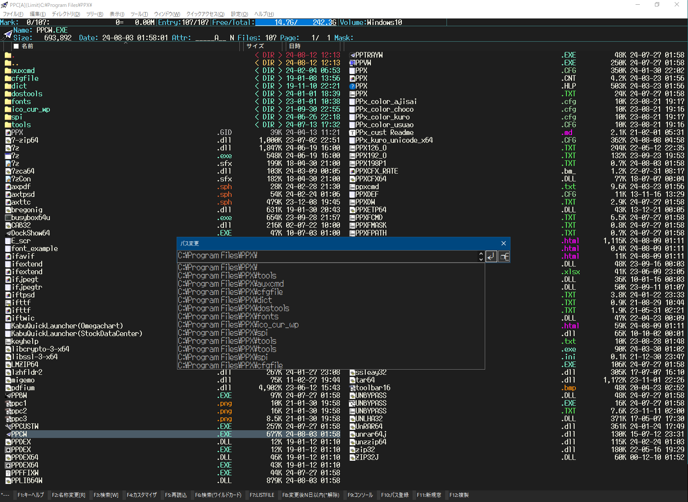
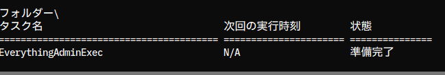
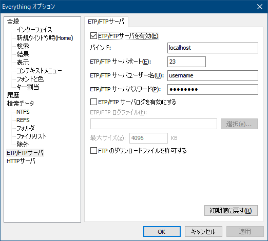
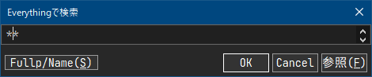

# PPx Customize Example

TORO 氏作のファイラー Paper Plane xUI のカスタマイズ例です。

---

# スクリーンショット



---

## このカスタマイズファイルの特長

- タブなしの独立した 1 画面による軽快な動作
- 目的別にまとめて管理できるタブ窓
- サブ窓（参照窓）で処理先を指定するファイルコピー方式
- zoxide によるパス補完
- 事前に生成したディレクトリパスリストを使用したジャンプ（[Shift+G]）
- [W]キーのメニューから Everything Search Engine を使用したファイル検索が可能
- あらかじめ生成した実行パスリストを使ってアプリ起動（[Shift+Z]）またはファイルを開く（[Shift+X]）

---

## ファイル構成

- PPx_kuro_unicode_x64.CFG（カスタマイズファイル本体）
- color-xxxx.CFG（色設定ファイル（着せ替え用））
- font_example_XXX.cfg (フォント設定例)
- keyhelp.txt（[F1]キーで表示されるキー操作一覧）
- key 検討用\ppxkey.xlsx（キー操作検討・エイリアス登録している実行ファイル詳細）

---

## インストール

### ファイルのコピー

PPx のインストールフォルダーに、実行ファイルと関連ファイル一式を配置します。

添付ファイル一式のうち、`PPx_kuro_unicode_x64.CFG` とその階層にあるファイル、およびサブフォルダーの内容を PPx のインストールフォルダーにコピーしてください。
`PPx_kuro_unicode_x64.CFG` と同じフォルダーに、`PPCW.exe` や `PPLIB64W.DLL` を含む PPx プログラム一式、およびその他の関連ファイルをコピーしてください。「（フォルダ：XXX）」と記載がある場合は、そのサブフォルダーを作成し、該当ファイルを格納してください。

**A）PPx 拡張モジュール**

- Message Module （`PPxMES64.dll`）
- CFX Module （`PPxCFX64.dll`）
- Text Module （`PPxtext64.dll`）
- Everything Search Module（`PPXETP64.dll`）
- Module Junk Parts（`PPxjunk64.dll`）
- PPx CCX Module（`PPxccx64.dll`）
- PPx Script Module（`PPxscr64.dll`）
- PPx Window Module（`PPxwin64.dll`）
- PPx WS Module（`PPxws64.dll`）
- Common Dialog Extender（`PPDEX64.exe`/`PPDEX.exe`）

**B）外部モジュール**

- `bregonig.dll`
- `migemo.dll`

**C）圧縮解凍ソフト**

- `7z.dll`
- `7z.exe`
- `7-zip64.dll`
- `RAR.exe` （フォルダ：`tools`）
- `UNRAR64.DLL`
- `UNRAR64J.DLL`
- `UNZZIP64.dll`
- `UNLHA32.dll`
- `CAB32.dll`
- `TAR64.dll`
- `UNBYPASS.dll`
- `unbypass.exe`

**D）64bit Susie プラグイン**

- `iftwic.sph`
- `ifjpegt.sph`
- `iftpsd.sph`
- `ifttf.sph`
- `ifextend.sph`
- `ifheif.sph`
- `axtpsd.sph`
- `axttc.sph`
- `ifgif.sph`
- `iftgdip.sph`
- `iftwebp.sph`
- `axpdf.sph`/`pdfium.dll`
- `runsph.exe` (PDF のサムネイル表示で必要)

**E）32bit Susie プラグイン（フォルダ：`SPI`）**

- `ifcrw_t.spi`（CANON CRW）
- `ifdxfft.spi`（DXF）
- `ifdwg.spi`（DWG）
- `runspi.exe`

**F）コマンドラインツール**

- `xdoc2txt.exe`（フォルダ：`tools`）
  [V]キーで `%ME_pager` の設定に従ってバイナリドキュメントファイルに含まれるテキストを `PPv[A]` で閲覧できます。
- `zoxide.exe`（フォルダ:`tools`）
- `es.exe`（フォルダ:`tools`）
- `exiftool.exe`（フォルダ:`tools`）
- `busybox64u.exe`
- `rg.exe`（フォルダ:`tools`）
- `fastcopy.exe`（フォルダ:`tools`）
- `ls2lf.exe`（フォルダ:`auxcmd`）

**G）フォント**

**メインウィンドウ**

- Plemol JP ConsoleNFJ-medium (https://github.com/yuru7/PlemolJP)
- UDEV Gothic (https://github.com/yuru7/udev-gothic)
- ばぐまるゴシック (https://debugx.net/BugSoft.aspx?Soft=BugMaruGothic)

※個人的には、少し太めのゼロ斜め線入りが好みです。

**一行編集・ダイアログ**

- Migu 1c (https://github.com/yuru7/udev-gothic)
- プログラミング用フォント Utatane (https://github.com/nv-h/Utatane)
- ばぐまる P ゴシック (https://debugx.net/BugSoft.aspx?Soft=BugMaruGothic)

**H）スクリプト**

必須ではないがあれば便利なもの

- `check_installed_module.js`（必要なファイルがインストールされているかチェック）
- `get_newest_filename.js`（カレントディレクトリのファイルの中で、最後に更新されたもの、または最後にアクセスされたものの名前を返す）
- `ocr_vision_api.py`（Google Vision OCR を Python から使う）
- `ocr_vision_api_batch.bat`（`ocr_vision_ocr.py` を少しだけ使いやすくするための bat ファイル）
- `create_index.js`（Google Vision OCR で OCR 処理したファイルから `00_index.txt` を生成）

---

### カスタマイズファイルの読み込み方法

1.  `PPx_kuro_unicode_x64.CFG` の内容をカスタマイザ（`PPCUSTW.exe`）で読み込みます。
2.  PPxを一度終了してから再起動してください。

---

### 初期設定

**A）X_save フォルダーの設定**

**`KC_main` の `FIRSTEVENT` に記述されている設定に従って自動で作成されます。**

1.  PPx インストールフォルダーが `C:\Program Files` 以下（例：`C:\Program Files\PPx`）の場合
    `X_save = %'APPDATA'\TOROID\PPx\userdata`
2.  PPx インストールフォルダーが `C:\Program Files` 以外（ポータブルインストール）の場合
    `X_save = （PPx インストールフォルダー）\userdata`

`X_save` フォルダー内には、リストファイル保存用の `listfile` フォルダーも自動で作成されます。

**B）zoxide の設定**

`zoxide.exe` を（PPx インストールフォルダー）`\tools` フォルダーに配置してください。

デフォルト設定の場合、独立窓 `PPc[A]` 起動時に zoxide の db（`db.zo`）を PPx の補完候補用ファイル（`l_dirZoxide.txt`）に自動変換します。

#### zoxide の独自カスタマイズ

このカスタマイズでは、以下の独自機能を実装しています。

**① ディレクトリ移動時の自動学習**

`KC_main` の `LOADEVENT` に `zoxide add` を設定しており、PPc 上でディレクトリを移動するたびに zoxide のデータベースへ自動的に記録されます。zoxide を直接操作しなくても学習が進むため、PPcを使い込むほど補完精度が向上します。

> **補足：** `[Shift+Enter]` で書庫内に入ったときに「ディレクトリ名が無効です(267)」が出る場合は、CFG の `LOADEVENT` の該当行をコメントアウトし、直下のコメントアウトされた代替行（要 `PPxjunk64.dll`）を有効にしてください。

**② [Shift+G] ジャンプへの補完リスト統合**

`[Shift+G]` で開くパスジャンプの一行編集では、zoxide が生成した `l_dirZoxide.txt` を補完リストとして使用します。デフォルトでは `dirpathList = l_dirWhereis.txt`（fenrirscan 生成リスト）が有効になっており、`l_dirZoxide.txt` と併用する形で補完候補が表示されます。

**③ コピー・移動時の宛先補完**

以下のコピー・移動キーで一行編集窓が開く際、`l_dirZoxide.txt` が存在する場合は自動的に補完リストへ読み込まれます。よく使うコピー先・移動先が zoxide の学習結果から候補として表示されます。

| キー | 動作 |
|---|---|
| `[C]` | PPc 標準コピー（サブ窓） |
| `[M]` | PPc 標準移動（サブ窓） |
| `[Shift+C]` | エクスプローラ互換コピー（サブ窓） |
| `[Shift+M]` | エクスプローラ互換移動（サブ窓） |
| `[Alt+C]` | PPc 標準コピーダイアログへ転送 |
| `[Alt+M]` | PPc 標準移動ダイアログへ転送 |

**④ 補完リストの手動更新**

`[Shift+G]` メニュー → 「補完リスト作成・更新(zoxide)」から手動で `l_dirZoxide.txt` を再生成できます。通常は `PPc[A]` 起動時に自動更新されますが、補完リストを即時更新したい場合に手動更新が役立ちます。

**C）Everything の設定**

Everything Search Module をインストールすると、一行編集の補完リストにも Everything の検索結果が表示されますが、ファイル・ディレクトリの区別がなく使いにくいため、OFF（`ETP_PART=0`）にすることを推奨します。

Everything Search Module の検索結果をリストアップしない代わりに、実行ファイル専用（`l_exeEverything.txt`）とディレクトリ専用（`l_dirEverything.txt`）の補完リストを Everything のコマンドライン版 `es.exe` で作成し、専用の一行編集窓から呼び出してジャンプ（[Shift+G]）またはアプリ起動（[Shift+Z]）できます。

また、実行ファイルリストを使って [Shift+X] キーで任意のプログラムからファイルを開くこともできます。

**設定手順：**

1. メニュー「設定(&O)」→「Everything を最小化してバックグラウンドで特権実行」を選び、サービス登録ダイアログが出たら「OK」を押します。
2. もう一度同じメニューでサービスが登録されているか確認します。
   正しく設定されていれば確認画面が表示されます。
   
3. Everything の ETP サーバ側も設定が必要です。図の通り設定してください（パスワード初期値は「password」）。
   
4. PPx の CFG では、以下のように設定します。必要に応じて書き換えてください。

```.js
  _User	= {
  ETP_FULL	= 10000
  ETP_PART	= 0
  ETP_PASS	= password
  ETP_PORT	= 23
  ETP_USER	= username
  EverythingAdminExec	= EverythingAdminExec
  }
```

[W]キーでファイル名検索（Everything）メニューを選ぶと、一行編集窓が開きます。



「Fullp/Name(S)」ボタンは、検索対象のドライブやパスをツリーから選択して絞り込むためのボタンです。もう一度押すとパス指定が解除されます（トグル動作）。

サブ窓（参照窓）にもこの一行編集窓を表示して、Everything 検索結果一覧を出すことができます。

ファイル hoge を同じフォルダーにコピーしたい場合は、コピー先にファイル hoge のパスをそのまま指定できます。これによりファイルの仕分けが効率化されます。

**D）Susie プラグインの設定**

PDF をサムネイルプレビューしたい場合は `ifextend.sph` の拡張子に PDF を登録してください。
`axpdf.sph` は「使用する」のチェックを外してください（インストール自体は必要です）。

**E）`PPXUMASK.TXT`・`PPXUPATH.TXT` の配置**

`PPWXXXX.DAT` が存在するフォルダーに配置してください。このカスタマイズ（`PPx_kuro_unicode.cfg`）では、`X_save` で指定したディレクトリ（`～\userdata`）の 1 つ上のフォルダーに配置します。

---

### 起動時およびアクティブ時の初期化設定

**`KC_main` の `FIRSTEVENT` では、以下の初期化処理を行います。**

- `X_save` フォルダーの自動設定
  - `C:\Program Files\PPx` の場合 → `X_save = %APPDATA%\TOROID\PPx\userdata`
  - それ以外の場合 → `X_save = （PPx インストールフォルダー）\userdata`
- `X_save` フォルダー内に `listfile` フォルダーがなければ自動作成
- エントリの並び順を「名前数値順」に設定
- 起動時ファイルマスクのリセット
- 連動ビュー（`PPv[X]`）を必ず OFF に設定
- タブ付きウィンドウ起動時のエントリ表示設定
- タブ付きウィンドウ起動時、記憶したディレクトリがあれば自動でジャンプ
- `zoxide.exe` が存在する場合、zoxide の `db.zo` を `l_dirZoxide.txt` に自動変換
- `PPc[W]` 起動時、コメント表示用のビュー設定

**`KC_main` の `ACTIVEEVENT` では、以下の処理を行います。主に一行編集をカスタマイズした後の設定初期化に使っています。**

- `XC_rmsk` のデフォルト値を設定（GUI で設定してもこの設定で上書きされます）
- REF ボタンの設定（条件により `K_lied:REFBUTTON` に `*refsel` を設定）
- `PPc[X]` 起動後に他の PPc がアクティブになった場合、コマンドを無効化しメッセージを表示
  - サブ窓でのコピー・移動には PPx Message Module が必須ですが、何らかの理由で動作しない場合に備え、`PPx_kuro_unicode.cfg` のコメントアウト部分を解除すると有効になる代替手段を用意しています。この設定は、その代替手段を有効にした際に使用されます。
- `Edit_OptionCmd` および `Edit_OptionTitle` の初期化

これらの設定は `KC_main` の `FIRSTEVENT` および `ACTIVEEVENT` に記述されており、PPx 起動時やアクティブ時に自動で実行されます。

---

## 主な独自カスタマイズ機能の使い方

### サブ窓（PPc[X]）を使ったコピー・移動

このカスタマイズでは、サブ窓（`PPc[X]`）を使ってコピー先・移動先を指定する方式を採用しています。**PPx Message Module（`PPxMES64.dll`）が必須**です。

1. コピーしたいファイルをマークして `[C]` キーを押します。
2. サブ窓（`PPc[X]`）が自動で開きますので、コピー先ディレクトリに移動して「.」（現在のディレクトリを示すエントリ）にカーソルを当てます。
自動で開いたPPc[X]を閉じて、一行編集でパスを直接入力することもできます。
3. `[Enter]` でコピーが実行されます。

移動の場合は `[M]` キーで同様の操作です。

> **補足：** `PPxMES64.dll` が何らかの理由で動作しない場合は、CFG のコメントアウトされた代替手段（`★★★サブ窓別解`）を有効にしてください。

---

### 一行編集の操作

コピー（`[C]`）・移動（`[M]`）・パス変更（`[Shift+L]`）・パスジャンプ（`[Shift+G]`）などで開く一行編集窓では、以下のキー操作が使えます。

**`[Ctrl+→]`　サブディレクトリ補完**

入力状態に応じて3段階で動作します。

1. **入力欄が空のとき** — カーソル上のエントリのフォルダ名を挿入し、末尾に `\` を付けてサブディレクトリの補完リストを表示します。
2. **末尾が `\` で終わっているとき** — 末尾の `\` を削除します（同じパスを履歴に重複登録しないための操作）。
3. **末尾が `\` 以外のとき** — 末尾に `\` を付加してサブディレクトリの補完リストを表示します。

**`[Ctrl+←]`　上位ディレクトリへ移動して補完**

入力状態に応じて2段階で動作します。

1. **入力欄が空のとき** — 補完リストをそのまま表示します。
2. **入力中のとき** — 現在のパスを1階層上に置き換え、末尾に `\` を付けてサブディレクトリの補完リストを表示します。

**補完リストの優先順位**

```
entry（近隣ディレクトリ） → ^hist:d（パス入力履歴除外） → user（zoxide 等） → path
```

**REF ボタン（サブ窓使用時）**

コピー・移動のサブ窓（`PPc[X]`）が開いているとき、一行編集窓の REF ボタンを押すと `*refsel` が実行されます。動作は一行編集の入力状態によって異なります。

- **`\` を含むパスが入力されているとき** — 入力中のパスをカレントとしてサブ窓（`PPc[Y]`）を新規に開き、エントリ選択モードに入ります。途中まで入力したパスをサブ窓で確認・選択しながら宛先を絞り込めます。
- **入力欄が空、またはパスが未入力のとき** — サブ窓（`PPc[Y]`）の現在のカレントディレクトリをそのまま宛先として選択します。

書庫名・出力ファイル名など**ファイルパスを指定する一行編集**では、REF ボタンに `*refselwithoutfile` が割り当てられます。`*refsel` との違いは、サブ窓でエントリを選択したときにファイル名部分を除いたディレクトリパスのみを一行編集に反映する点です。たとえば書庫名の入力中に REF ボタンを押すと、サブ窓で選んだディレクトリが保存先として設定され、ファイル名は一行編集の入力内容が維持されます。

**一行編集オプションボタン（`[Alt+S]`）による補完リスト・オプション切り替え**

一行編集窓の左下にオプションボタン（`[Alt+S]`）が表示されるときは、ボタンを押すと、その一行編集の用途に応じたオプションメニューが開きます。

| 一行編集の用途 | メニュー内容 |
|---|---|
| パスジャンプ（`[Shift+G]`） | 補完リスト切替（Whereis / FenrirScan / Everything / Zoxide）・マッチ方式切替（ドット区切り and・正規表現）・補完リスト作成・更新・履歴操作 |
| アプリ起動（`[Shift+Z]`・`[Shift+X]`） | 補完リスト切替（Whereis / Everything）・マッチ方式切替・補完リスト作成・更新・履歴操作・親ディレクトリを開く |
| ripgrep 検索 | 検索対象文字コードの切り替え（UTF-8 / EUC-JP / Shift-JIS） |
| キーヘルプ（`[F1]`） | キーヘルプ表示 / 簡易 PPxfazzy（メニュー検索）切り替え |

---

### タブ窓とタブグループ

タブ付きウィンドウ（`PPc -combo`）では、A〜G のタブグループを切り替えて目的別にフォルダ構成を管理できます。

- **新規タブ付きウィンドウ起動：** `[Shift+Tab]` または `[Shift+F11]`
- **タブグループの切り替え：** ウィンドウメニュー（`[W]`キー → ウィンドウ）からタブグループを選択
- **タブを閉じる：** `[Ctrl+F4]` または `[Ctrl+W]`
- **新規タブ：** `[Ctrl+T]`

タブグループには任意の名前を付けられます（`S_tabgroupname` で設定）。

> **注意：** タブグループ機能を使うには `X_combos` の 2 項目目の B7 を 1 に設定する必要があります。

---

### ファンクションバーの切り替え

画面下部のファンクションバー（`B_cdef` 系）は、左端のボタンをクリックするたびに4種類のバーを順番に切り替えられます。現在どのバーが表示されているかは、左端ボタンのアスタリスク（`*`）の位置で確認できます。

| ボタン表示 | バー | 内容 |
|---|---|---|
| `---*` | B_cdef | 標準操作ボタン（Back / Next / Copy / Paste / Delete など） |
| `*---` | B_cdef2 | ファンクションキー（F1〜F12） |
| `-*--` | B_cdef3 | Shift+ファンクションキー（Shift+F1〜F12） |
| `--*-` | B_cdef4 | Ctrl+ファンクションキー（Ctrl+F1〜F12） |

---

### 配色テーマの切り替え

メニューバーの「設定」→「画面配色と壁紙」から配色テーマを切り替えられます。

用意されているテーマ：
- 画面配色黒（`color-kuro.cfg`）
- iceberg 風（`color-iceberg_taste.cfg`）
- gruvbox 風（`color-gruvbox_taste.cfg`）
- チョコ（`color-choco.cfg`）
- 紫陽花（`color-ajisai.cfg`）
- 薄青（`color-usuao.cfg`）

各テーマは `color-xxxx.CFG` ファイルとして提供されており、カスタマイザから直接読み込むことも可能です。

---

### 個人設定のバックアップと復元

メニューバーの「設定」→「X_save フォルダにバックアップ」から個人設定をバックアップできます。

バックアップできる内容：
- **PersonalAll**：クイックアクセス・拡張子判別・パス履歴・ユーザー設定・タブグループ名・記憶ディレクトリをまとめてバックアップ
- **A_exec**：エイリアス設定のみ
- **M_pjump**：クイックアクセスリストのみ
- **E_scr**：拡張子判別実行設定のみ

バックアップファイルは `X_save` フォルダーに日時付きで保存されます。復元は「設定」→「CFG ファイルの取込」から行えます。

> **注意：** インストール環境をポータブルから通常インストール（`C:\Program Files` 配下）へ、またはその逆に変更した場合、`X_save` のパスが自動で切り替わります。バックアップファイルの保存先が変わるため、移行前に必ずバックアップを取っておいてください。

---

### 一行メモとリマインダー

`[Ctrl+M]` キーでメモメニューを開けます。

- **一行メモを記入：** 入力した内容を日時付きで `memo.txt` に追記します。
- **一行メモを表示：** `PPv` でメモ一覧を表示します。
- **一行メモをエディタで開く：** エディタで `memo.txt` を直接編集します。
- **リマインダー：** タスクスケジューラに登録して、指定時刻に一度だけメモを表示させることができます。

メモファイル（`memo.txt`）は `X_save` フォルダーに保存されます。

---

### OCR 機能

画像ファイルの認識結果を00_index.txtというファイルに保存し、PPcのコメント検索機能から認識した文字を含むファイルを検索できるようになります。対象ファイルをマークして「ツール」メニュー→「OCR処理」から選択します。

用意されている OCR：
- **Umi-OCR**（ローカル処理）：マークしたファイルを Umi-OCR で処理し、同名フォルダに `00_index.txt` として出力します。日本語 OCR に対応しており、インターネット接続不要で動作します。
- **Google Cloud Vision OCR**（クラウド処理）：`ocr_vision_api_batch.bat` 経由で処理し、同名の `.txt` ファイルに出力します。利用には Google Cloud の API キー設定が必要です。「マークファイルと同名のtxtファイルの中身をコメントにして00_index.txt作成」メニューより00_index.txtを作成してください。

---


- 本カスタマイズは自由に改変してご利用いただけます。
- 本ドキュメントの内容は予告なく加筆・修正されることがあります。
