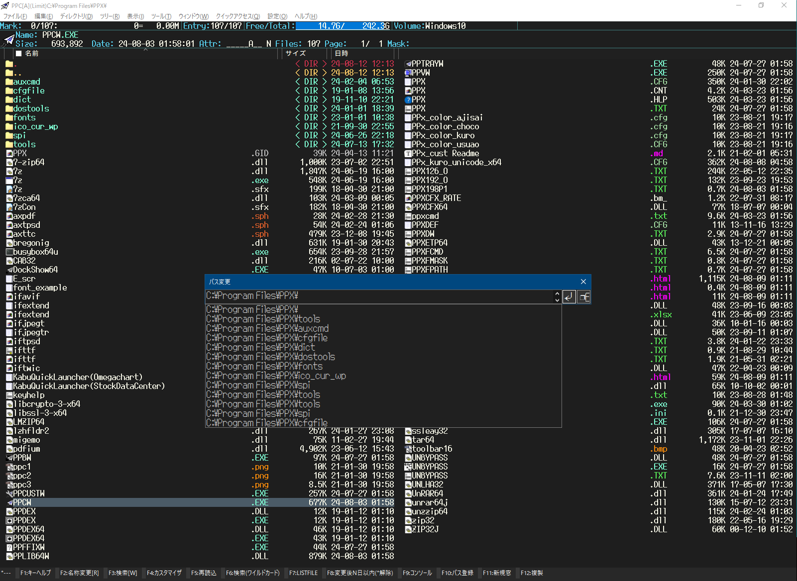
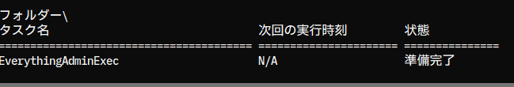
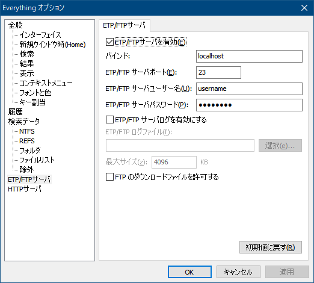
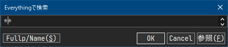

# PPx Customize Example

TORO 氏作のファイラー Paper Plane xUI のカスタマイズ例です。

**PPx 入手先：** [TORO's Library](http://toro.d.dooo.jp/slppx.html) / [バイナリアーカイブ（GitHub）](https://github.com/toroidj/toroidj.github.io/tree/master/ppx)

---

# スクリーンショット



---

## キーバインド一覧

### アルファベットキー（A〜Z）

| キー | 機能 | 参照セクション |
|---|---|---|
| `[A]` | 属性変更（Attribute） | |
| `[B]` | バイナリ変換（Binary） | |
| `[C]` | エントリコピー（Copy） | サブ窓を使ったコピー・移動 |
| `[D]` | エントリ削除・ごみ箱へ（Delete） | |
| `[E]` | エディタで新規タブを開いて編集（Edit） | |
| `[F]` | ファイルマスク・一時設定（Find） | |
| `[G]` | Grep（Grep） | |
| `[H]` | アクセス履歴 / 入力履歴（History） | |
| `[I]` | ドライブ情報（drive Info） | |
| `[J]` | インクリメンタルサーチ（Jump） | |
| `[K]` | ディレクトリ作成（maKe directory） | |
| `[L]` | ドライブ変更（Logdisk） | |
| `[M]` | エントリ移動（Move） | サブ窓を使ったコピー・移動 |
| `[N]` | ネットワークドライブ / デバイスイジェクト（Network and eject） | |
| `[O]` | ファイル比較（cOmpare） | |
| `[P]` | 書庫に圧縮（Pack archive） | ファイルの圧縮・解凍 |
| `[Q]` | クイックアクセス（Quick Access） | |
| `[R]` | 名前変更（Rename） | |
| `[S]` | エントリのソート・一時設定（Sort file） | |
| `[T]` | ツリー一時表示・フォーカス移動（Tree view） | |
| `[U]` | 書庫解凍（Unpack archive） | ファイルの圧縮・解凍 |
| `[V]` | PPv[A]〜[W] で表示・複数起動可・バイナリ→テキスト表示（View file） | [V] / [Y] キーによる PPv 起動の違い |
| `[W]` | ファイル検索（Wildcard search） | |
| `[X]` | コマンド実行（shell eXecute） | |
| `[Y]` | PPv[Y] で表示・ホイールで前 / 次ファイル | [V] / [Y] キーによる PPv 起動の違い |
| `[Z]` | アプリケーションランチャ（Applauncher） | |

---

## このカスタマイズファイルの特長

- タブなしの独立した 1 画面による軽快な動作
- 目的別にワークスペース（A〜Z）を切り替えて管理できるタブ窓（→ [ワークスペースの切り替え](#ワークスペースの切り替え)）
- サブ窓（参照窓）で処理先を指定するファイルコピー方式（→ [サブ窓を使ったコピー・移動](#サブ窓ppcxを使ったコピー移動)）
- PPv を PPc 下部にドッキングして連動プレビューする MIEL モード `[Shift+Y]`（→ [MIEL 風連動ビュー](#miel-風-ppcppv-連動ビューmielモード)）
- zoxide によるパス補完・自動学習（→ [zoxide の設定](#b-zoxide-の設定)）
- 事前生成したディレクトリ／実行ファイルパスリストへのジャンプ・起動（`[Shift+G]` / `[Shift+Z]` / `[Shift+X]`）
- [W] キーメニューから Everything を使ったファイル検索
- [Ctrl+F6] 窓構成適応・全域検索（独立窓なら全窓、タブ窓ならグループ内を自動判別して検索）
- Exiftool を使った撮影日時によるファイル名一括変換（→ [Exiftool によるファイル名一括変換](#exiftool-によるファイル名一括変換)）
- PPx 内で完結する一行メモとリマインダー（→ [一行メモとリマインダー](#一行メモとリマインダー)）

---

## ファイル構成

- PPx_kuro_unicode_x64.CFG（カスタマイズファイル本体）
- color-xxxx.CFG（色設定ファイル（着せ替え用））
- font_example_XXX.cfg (フォント設定例)
- keyhelp.txt（[F1]キーで表示されるキー操作一覧）
- key 検討用\ppxkey.xlsx（キー操作検討・エイリアス登録している実行ファイル詳細）

---

## インストール

### ファイルの入手

[GitHub リポジトリ](https://github.com/ppxbpfiles/Paper-Plane-xUI-customize-example) から最新の設定ファイルをダウンロードします。

リポジトリ右上の「Code」ボタンをクリックし、「Download ZIP」を選択してダウンロードし、適当な場所に展開してください。

### ファイルのコピー

PPx のインストールフォルダーに、実行ファイルと関連ファイル一式を配置します。

添付ファイル一式のうち、`PPx_kuro_unicode_x64.CFG` とその階層にあるファイル、およびサブフォルダーの内容を PPx のインストールフォルダーにコピーしてください。
`PPx_kuro_unicode_x64.CFG` と同じフォルダーに、`PPCW.exe` や `PPLIB64W.DLL` を含む PPx プログラム一式、およびその他の関連ファイルをコピーしてください。「（フォルダ：XXX）」と記載がある場合は、そのサブフォルダーを作成し、該当ファイルを格納してください。

**A）PPx 拡張モジュール**

- Message Module （`PPxMES64.dll`）
- CFX Module （`PPxCFX64.dll`）
- Text Module （`PPxtext64.dll`）
- Everything Search Module（`PPXETP64.dll`）
- Module Junk Parts（`PPxjunk64.dll`）
- PPx CCX Module（`PPxccx64.dll`）
- PPx Script Module（`PPxscr64.dll`）
- PPx Window Module（`PPxwin64.dll`）
- PPx WS Module（`PPxws64.dll`）
- Common Dialog Extender（`PPDEX64.exe`/`PPDEX.exe`）
- PPx Tool Support Module（`ppxsup64.dll`）※Soyokaze でメニュー検索を使う場合

**B）外部モジュール**

- `bregonig.dll`
- `migemo.dll`

**C）圧縮解凍ソフト**

- `7z.dll`
- `7z.exe`
- `7-zip64.dll`
- `RAR.exe` （フォルダ：`tools`）
- `UNRAR64.DLL`
- `UNRAR64J.DLL`
- `UNZZIP64.dll`
- `UNLHA32.dll`
- `CAB32.dll`
- `TAR64.dll`
- `UNBYPASS.dll`
- `unbypass.exe`

**D）64bit Susie プラグイン**

- `iftwic.sph`
- `ifjpegt.sph`
- `iftpsd.sph`
- `ifttf.sph`
- `ifextend.sph`
- `ifheif.sph`
- `axtpsd.sph`
- `axttc.sph`
- `ifgif.sph`
- `iftgdip.sph`
- `iftwebp.sph`
- `axpdf.sph`/`pdfium.dll`
- `runsph.exe` (PDF のサムネイル表示で必要)

**E）32bit Susie プラグイン（フォルダ：`SPI`）**

- `ifcrw_t.spi`（CANON CRW）
- `ifdxfft.spi`（DXF）
- `ifdwg.spi`（DWG）
- `runspi.exe`

**F）コマンドラインツール**

- `xdoc2txt.exe`（フォルダ：`tools`）
  [V]キーで `%ME_pager` の設定に従ってバイナリドキュメントファイルに含まれるテキストを `PPv[A]` で閲覧できます。
- `zoxide.exe`（フォルダ:`tools`）
- `es.exe`（フォルダ:`tools`）
- `exiftool.exe`（フォルダ:`tools`）
- `busybox64u.exe`
- `rg.exe`（フォルダ:`tools`）
- `fastcopy.exe`（フォルダ:`tools`）
- `fzf.exe`（フォルダ：`tools`）—— サブディレクトリのインタラクティブ検索で使用(Ctrl+J)
- `ls2lf.exe`（フォルダ:`auxcmd`）

**G）フォント**

**メインウィンドウ**

- Plemol JP ConsoleNFJ-medium (https://github.com/yuru7/PlemolJP)
- UDEV Gothic (https://github.com/yuru7/udev-gothic)
- ばぐまるゴシック (https://debugx.net/BugSoft.aspx?Soft=BugMaruGothic)

※個人的には、少し太めのゼロ斜め線入りが好みです。

**一行編集・ダイアログ**

- Migu 1c (https://github.com/yuru7/udev-gothic)
- プログラミング用フォント Utatane (https://github.com/nv-h/Utatane)
- ばぐまる P ゴシック (https://debugx.net/BugSoft.aspx?Soft=BugMaruGothic)

**H）スクリプト**

必須ではないがあれば便利なもの

- `check_installed_module.js`（必要なファイルがインストールされているかチェック）
- `get_newest_filename.js`（カレントディレクトリのファイルの中で、最後に更新されたもの、または最後にアクセスされたものの名前を返す）
- `ocr_vision_api.py`（Google Vision OCR を Python から使う）
- `ocr_vision_api_batch.bat`（`ocr_vision_ocr.py` を少しだけ使いやすくするための bat ファイル）
- `create_index.js`（Google Vision OCR で OCR 処理したファイルから `00_index.txt` を生成）
- `word_move_rename.js`（一行編集リネームダイアログで数字列・非数字列の境界へカーソルをジャンプ）

---

### カスタマイズファイルの読み込み方法

1.  `PPx_kuro_unicode_x64.CFG` の内容をカスタマイザ（`PPCUSTW.exe`）で読み込みます。
2.  PPcを一度終了してから再起動してください。

---

### 初期設定

**A）X_save フォルダーの設定**

**`KC_main` の `FIRSTEVENT` に記述されている設定に従って自動で作成されます。**

1.  PPx インストールフォルダーが `C:\Program Files` 以下（例：`C:\Program Files\PPx`）の場合
    `X_save = %'APPDATA'\TOROID\PPx\userdata`
2.  PPx インストールフォルダーが `C:\Program Files` 以外（ポータブルインストール）の場合
    `X_save = （PPx インストールフォルダー）\userdata`

`X_save` フォルダー内には、リストファイル保存用の `listfile` フォルダーも自動で作成されます。

**B）zoxide の設定**

`zoxide.exe` を（PPx インストールフォルダー）`\tools` フォルダーに配置してください。

デフォルト設定の場合、独立窓 `PPc[A]` 起動時に zoxide の db（`db.zo`）を PPc の補完候補用ファイル（`l_dirZoxide.txt`）に自動変換します。

#### zoxide の独自カスタマイズ

このカスタマイズでは、以下の独自機能を実装しています。

**① ディレクトリ移動時の自動学習**

`KC_main` の `LOADEVENT` に `zoxide add` を設定しており、PPc 上でディレクトリを移動するたびに zoxide のデータベースへ自動的に記録されます。zoxide を直接操作しなくても学習が進むため、PPcを使い込むほど補完精度が向上します。

> **補足：** `[Shift+Enter]` で書庫内に入ったときに「ディレクトリ名が無効です(267)」が出る場合は、CFG の `LOADEVENT` の該当行をコメントアウトし、直下のコメントアウトされた代替行（要 `PPxjunk64.dll`）を有効にしてください。

**② [Shift+G] ジャンプへの補完リスト統合**

`[Shift+G]` で開くパスジャンプの一行編集では、zoxide が生成した `l_dirZoxide.txt` を補完リストとして使用します。デフォルトでは `dirpathList = l_dirWhereis.txt`（*whereis 検索結果リスト）が有効になっており、`l_dirZoxide.txt` と併用する形で補完候補が表示されます。

**③ コピー・移動時の宛先補完**

以下のコピー・移動キーで一行編集窓が開く際、`l_dirZoxide.txt` が存在する場合は自動的に補完リストへ読み込まれます。よく使うコピー先・移動先が zoxide の学習結果から候補として表示されます。

| キー | 動作 |
|---|---|
| `[C]` | PPc 標準コピー（サブ窓） |
| `[M]` | PPc 標準移動（サブ窓） |
| `[Shift+C]` | エクスプローラ互換コピー（サブ窓） |
| `[Shift+M]` | エクスプローラ互換移動（サブ窓） |
| `[Alt+C]` | PPc 標準コピーダイアログへ転送 |
| `[Alt+M]` | PPc 標準移動ダイアログへ転送 |

**④ 補完リストの手動更新**

`[Shift+G]` メニュー → 「補完リスト作成・更新(zoxide)」から手動で `l_dirZoxide.txt` を再生成できます。通常は `PPc[A]` 起動時に自動更新されますが、補完リストを即時更新したい場合に手動更新が役立ちます。

**C）Everything の設定**

Everything Search Module をインストールすると、一行編集の補完リストにも Everything の検索結果が表示されますが、ファイル・ディレクトリの区別がなく使いにくいため、OFF（`ETP_PART=0`）にすることを推奨します。

Everything Search Module の検索結果をリストアップしない代わりに、実行ファイル専用（`l_exeEverything.txt`）とディレクトリ専用（`l_dirEverything.txt`）の補完リストを Everything のコマンドライン版 `es.exe` で作成し、専用の一行編集窓から呼び出してジャンプ（[Shift+G]）またはアプリ起動（[Shift+Z]）できます。

また、実行ファイルリストを使って [Shift+X] キーで任意のプログラムからファイルを開くこともできます。

**設定手順：**

1. メニュー「設定(&O)」→「Everything を最小化してバックグラウンドで特権実行」を選び、サービス登録ダイアログが出たら「OK」を押します。
2. もう一度同じメニューでサービスが登録されているか確認します。
   正しく設定されていれば確認画面が表示されます。
   
3. Everything の ETP サーバ側も設定が必要です。図の通り設定してください（パスワード初期値は「password」）。
   
4. PPx の CFG では、以下のように設定します。必要に応じて書き換えてください。

```.js
  _User	= {
  ETP_FULL	= 10000
  ETP_PART	= 0
  ETP_PASS	= password
  ETP_PORT	= 23
  ETP_USER	= username
  EverythingAdminExec	= EverythingAdminExec
  }
```

[W]キーでファイル名検索（Everything）メニューを選ぶと、一行編集窓が開きます。



「Fullp/Name(S)」ボタンは、検索対象のドライブやパスをツリーから選択して絞り込むためのボタンです。もう一度押すとパス指定が解除されます（トグル動作）。

サブ窓（参照窓）にもこの一行編集窓を表示して、Everything 検索結果一覧を出すことができます。

**サブ窓上での Everything 検索でコピー先を指定する**

`[C]` / `[M]` キーで開いたサブ窓（`PPc[X]` / `PPc[Y]`）上で `[W]` キーを押すと検索メニューが開き、「ファイル名・ディレクトリ名検索（Everything）」を選ぶと検索結果がそのサブ窓にリストとして読み込まれます。通常のディレクトリブラウズでは辿りにくい場所にあるコピー先を、キーワード検索で素早く指定できます。

**ファイルパスを指定して「そのファイルのある場所」にコピーする**

コピー先・移動先にはディレクトリではなくファイルのフルパスをそのまま指定できます。その場合、指定したファイルが存在するディレクトリがコピー先・移動先として使われます。上記の Everything 検索結果からファイルを見つけたとき、そのファイルと同じフォルダーに別のファイルを送りたい場合に、わざわざディレクトリを辿らずにファイルパスをそのまま使えます。

**重複ファイルの検索と整理**

`[W]` キーのメニュー → 「PPc[W] で Everything の DB から重複ファイルを抽出」を選ぶと、ファイル名パターンと最小サイズを指定するダイアログが開き、Everything のデータベースから同サイズの重複候補をリストアップします。結果は `PPc[W]` にリストファイルとして読み込まれ、さらに `*comparemark` で内容一致を確認した上でマークを整理し、サイズ降順にソートされた状態で表示されます。大容量の重複ファイルから優先的に確認できます。

**窓構成適応・全域検索（[Ctrl+F6]）**

現在の窓の配置（レイアウト）に応じて、検索対象を自動的に判別します。

- **独立窓（シングル窓）から実行した場合**: 起動しているすべての PPc 窓（全 ID）を検索対象にします。
- **タブ窓（PPcW 等のグループ）から実行した場合**: そのタブグループに含まれる窓のみを検索対象にします。

これにより、ワークスペースを分けて作業している場合はその中だけで、独立して使っている場合はすべての場所を網羅して、手間なく横断検索が可能です。

**D）Susie プラグインの設定**

**PDF のサムネイルプレビュー**

PDF のサムネイル表示には `axpdf.sph`（pdfium ベース）を直接使わず、`ifextend.sph` + `runsph.exe` 経由で `axpdf.sph` を呼び出す方式を採用しています。Acrobat がインストールされていない環境でも PDF のサムネイルを表示できます。

設定済みの内容は `ifextend.CFG` の先頭ブロックに記載されています。

```
*.pdf
&>ppbw.exe -c %Osd "%0runsph.exe" "%0axpdf.sph" "%src%" -e %'temp' "%*name(XN,"%src%")000.bmp" %:ren "%'temp'%\%*name(XN,"%src%")000.bmp" %*name(C,"%dst%")
```

必要なファイルと設定：

1. `axpdf.sph` と `pdfium.dll` を PPx インストールフォルダーに配置します。
2. `runsph.exe` を PPx インストールフォルダーに配置します。
3. `ifextend.sph` と `ifextend.CFG` を PPx インストールフォルダーに配置します。
4. PPx のカスタマイザで `ifextend.sph` を「使用する」に設定します。
5. `axpdf.sph` は「使用する」の**チェックを外してください**（ファイル自体は必要です）。

> **補足：** `ifextend.CFG` を変更した場合は、カスタマイザで `ifextend.sph` を一度「使用しない」→「使用する」と切り替えてプラグインを再読み込みしてください。

**E）`PPXUMASK.TXT`・`PPXUPATH.TXT` の配置**

`PPWXXXX.DAT` が存在するフォルダーに配置してください。このカスタマイズ（`PPx_kuro_unicode.cfg`）では、`X_save` で指定したディレクトリ（`～\userdata`）の 1 つ上のフォルダーに配置します。

---

### 起動時およびアクティブ時の初期化設定

**`KC_main` の `FIRSTEVENT` では、以下の初期化処理を行います。**

- `X_save` フォルダーの自動設定
  - `C:\Program Files\PPx` の場合 → `X_save = %APPDATA%\TOROID\PPx\userdata`
  - それ以外の場合 → `X_save = （PPx インストールフォルダー）\userdata`
- `X_save` フォルダー内に `listfile` フォルダーがなければ自動作成
- エントリの並び順を「名前数値順」に設定
- 起動時ファイルマスクのリセット
- 連動ビュー（`PPv[X]`）を必ず OFF に設定
- タブ付きウィンドウ起動時のエントリ表示設定
- タブ付きウィンドウ起動時、記憶したディレクトリがあれば自動でジャンプ
- `zoxide.exe` が存在する場合、zoxide の `db.zo` を `l_dirZoxide.txt` に自動変換
- `PPc[W]` 起動時、コメント表示用のビュー設定

**`KC_main` の `ACTIVEEVENT` では、以下の処理を行います。**

`ACTIVEEVENT` は PPc がアクティブになるたびに実行されます。一行編集を開く直前に `*setcust` や `*customize` で設定を一時的に変更しておき、一行編集を閉じると PPc がアクティブになるタイミングで自動的に元の設定へ戻す、という仕組みに使っています。これにより一行編集の用途ごとに動作を変えつつ、終了後は常にクリーンな状態に戻せます。

- `XC_rmsk` のデフォルト値を設定 — 一行編集の種類によって一時変更されるマスク設定を毎回リセットします（GUI で設定してもこの設定で上書きされます）
- `K_lied:REFBUTTON` を `*refsel` に戻す — 一行編集の用途によって `*refselwithoutfile` 等に切り替わった REF ボタンを標準の動作に戻します
- `Edit_OptionCmd` / `Edit_OptionTitle` の初期化 — `[Alt+S]` オプションボタンの内容をクリアします

また上記とは別に、`PPc[X]` 起動後に他の PPc がアクティブになった場合、コマンドを無効化しメッセージを表示する処理も行います。サブ窓でのコピー・移動には PPx Message Module が必須ですが、何らかの理由で動作しない場合に備え、`PPx_kuro_unicode.cfg` のコメントアウト部分を解除すると有効になる代替手段を用意しています。この設定は、その代替手段を有効にした際に使用されます。

これらの設定は `KC_main` の `FIRSTEVENT` および `ACTIVEEVENT` に記述されており、PPc 起動時やアクティブ時に自動で実行されます。

---

## 主な独自カスタマイズ機能の使い方

### サブ窓（PPc[X]）を使ったコピー・移動

このカスタマイズでは、サブ窓（`PPc[X]`）を使ってコピー先・移動先を指定する方式を採用しています。**PPx Message Module（`PPxMES64.dll`）が必須**です。

1. コピーしたいファイルをマークして `[C]` キーを押します。
2. サブ窓（`PPc[X]`）が自動で開きますので、コピー先ディレクトリに移動して「.」（現在のディレクトリを示すエントリ）にカーソルを当てます。
自動で開いたPPc[X]を閉じて、一行編集でパスを直接入力することもできます。
3. `[Enter]` でコピーが実行されます。

移動の場合は `[M]` キーで同様の操作です。

> **補足：** `PPxMES64.dll` が何らかの理由で動作しない場合は、CFG のコメントアウトされた代替手段（`★★★サブ窓別解`）を有効にしてください。

**タブ窓を仕分け先として活用する**

独立窓（`PPc[A]` など）で `[C]` を押すと、対応するタブ窓（`PPc -combo`）の現在地がサブ窓の起点として自動的に使われます。タブ窓に仕分け先のフォルダーをあらかじめ複数タブで開いておけば、独立窓側で仕分け元を操作しながら `[Ctrl+←]` / `[Ctrl+→]` でタブを切り替えて任意のフォルダーを素早くコピー先に指定できます。

タブ窓（`PPc[Za?]` など）から `[C]` を押した場合は、起動中の全 PPc 一覧メニューが表示され、その中から任意の窓をサブ窓の起点として選べます。

---

### インクリメンタルサーチの拡張

`[J]` キーで起動する検索（Migemo 連携）では、以下の操作が可能です。

- **ローマ字検索** — 日本語ファイル名もローマ字のまま検索できます。
- **マッチ箇所の一括ハイライト (`[F2]`)** — 検索中に `[F2]` を押すと、マッチしたエントリすべてに着色します。検索終了後も対象を視覚的に把握できます。
- **一括マーク (`[F3]`)** — マッチしたエントリをすべて選択状態にします。

---

### fzf によるインタラクティブサーチ

`[Ctrl+J]` キーを押すと、現在のフォルダ以下の全てのファイル・フォルダを `fzf` でインクリメンタル検索できます。`fzf` 窓は PPx 窓の中央に自動配置されます。

- **Enter**: 選択したファイル/フォルダへジャンプ（ファイルの場合は親フォルダへ移動しカーソルを合わせる）
- **ESC**: 中止

---

### 一行編集の操作

コピー（`[C]`）・移動（`[M]`）・パス変更（`[Shift+L]`）・パスジャンプ（`[Shift+G]`）などで開く一行編集窓では、以下のキー操作が使えます。

**`[Ctrl+→]`　サブディレクトリ補完**

入力状態に応じて3段階で動作します。

1. **入力欄が空のとき** — カーソル上のエントリのフォルダ名を挿入し、末尾に `\` を付けてサブディレクトリの補完リストを表示します。
2. **末尾が `\` で終わっているとき** — 末尾の `\` を削除します（同じパスを履歴に重複登録しないための操作）。
3. **末尾が `\` 以外のとき** — 末尾に `\` を付加してサブディレクトリの補完リストを表示します。

**`[Ctrl+←]`　上位ディレクトリへ移動して補完**

入力状態に応じて2段階で動作します。

1. **入力欄が空のとき** — 補完リストをそのまま表示します。
2. **入力中のとき** — 現在のパスを1階層上に置き換え、末尾に `\` を付けてサブディレクトリの補完リストを表示します。

**`[Ctrl+;]` / `[Ctrl+:]`　日時の挿入**

- **`[Ctrl+;]`** — 現在の日時を `YYYY-MM-DD` 形式で挿入します。
- **`[Ctrl+:]`** — カーソル上のファイルの作成日時を `YYYY-MM-DD` 形式で挿入します。

**補完リストの優先順位**

```
entry（カレントディレクトリ内のディレクトリ） → ^hist:d（ディレクトリ） → user（zoxide 等） → path（パス補完候補ファイル(PPXUPATH.TXT)）
```

**REF ボタン**

一行編集窓の REF ボタンを押すと `*refsel` が実行されます。動作は一行編集の入力状態によって異なります。

- **`\` を含むパスが入力されているとき** — 入力中のパスをカレントとしてサブ窓（`PPc[Y]`）を新規に開き、エントリ選択モードに入ります。途中まで入力したパスをサブ窓で確認・選択しながら宛先を絞り込めます。
- **入力欄が空、またはパスが未入力のとき** — サブ窓（`PPc[Y]`）の現在のカレントディレクトリをそのまま宛先として選択します。

書庫名・出力ファイル名など**ファイルパスを指定する一行編集**では、REF ボタンに `*refselwithoutfile` が割り当てられます。`*refsel` との違いは、サブ窓でエントリを選択したときにファイル名部分を除いたディレクトリパスのみを一行編集に反映する点です。たとえば書庫名の入力中に REF ボタンを押すと、サブ窓で選んだディレクトリが保存先として設定され、ファイル名は一行編集の入力内容が維持されます。

**一行編集オプションボタン（`[Alt+S]`）による補完リスト・オプション切り替え**

一行編集窓の左下にオプションボタン（`[Alt+S]`）が表示されるときは、ボタンを押すと、その一行編集の用途に応じたオプションメニューが開きます。

| 一行編集の用途 | メニュー内容 |
|---|---|
| パスジャンプ（`[Shift+G]`） | 補完リスト切替（Whereis / FenrirScan / Everything / Zoxide）・マッチ方式切替（ドット区切り and・正規表現）・補完リスト作成・更新・履歴操作 |
| アプリ起動（`[Shift+Z]`・`[Shift+X]`） | 補完リスト切替（Whereis / Everything）・マッチ方式切替・補完リスト作成・更新・履歴操作・親ディレクトリを開く |
| ripgrep 検索 | 検索対象文字コードの切り替え（UTF-8 / EUC-JP / Shift-JIS） |
| キーヘルプ（`[F1]`） | キーヘルプ表示 / 簡易 PPxfazzy（メニュー検索）切り替え |

---

### 窓の起動と連携

**窓 ID の用途一覧**

| ID | 用途 |
|---|---|
| `PPc[A]`〜`[B]`（独立窓） | メイン操作窓。`[Tab]` で2画面切り替え、`[F11]` で3枚目以降を追加起動 |
| `PPc[W]` | 検索結果・リストファイル表示専用。`-single` で常に1枚に限定 |
| `PPc[X]` | サブ窓（コピー・移動・解凍の宛先指定） |
| `PPc[Y]` | サブ窓（一行編集の REF ボタンからのファイル選択） |
| `PPc[Z]` | Common File Dialog Extenderによるパス選択用 |
| `PPc[Z??]`（タブ窓） | タブ付きウィンドウ。A〜Z のワークスペースで目的別に管理 |

| ID | 用途 | PPv表示モード |
|---|---|---|
| `PPv[A]`〜`[I]` | `[V]` キーで起動。未使用 ID を自動割り当て、複数同時起動可 | キャレットモード |
| `PPv[J]`〜`[X]` | MIEL モード連動ビュー。`[Shift+Y]` で X から逆順に未使用 ID を割り当て<br />（J より前には割り当てない） | ページモード |
| `PPv[Y]` | `[Y]` キーで起動。固定 ID、ホイールで前後ファイル切り替え | ページモード |
| `PPv[Z]` | チッププレビュー（`[Shift+V]`）専用 | ページモード |

---

**窓の起動**

| キー | 動作 |
|---|---|
| `[Tab]` | PPc・PPv が1〜2枚かつ PPv なしの場合は標準のID切替（独立2画面連携ファイラーとして動作）、それ以外は起動中の窓選択メニューを表示 |
| `[F11]` | 新規 PPc を独立窓で起動（主に3枚目以降。2枚目までは `[Tab]` で起動可） |
| `[Shift+Tab]` / `[Shift+F11]` | タブ付き新規窓（`PPc -combo`）を起動 |
| `[Ctrl+F11]` | 新規 PPc を管理者権限で起動 |

**窓間の移動**

| キー | 動作 |
|---|---|
| `[Ctrl+←]` / `[Ctrl+→]` | 前 / 次のタブまたは独立窓に移動 |

タブ付きウィンドウ（`PPc -combo`）と独立窓（`PPc -alone`）が混在していても、すべての PPc を起動順に並べたリストとして一続きに切り替えられます。リストの先頭 / 末尾に達すると反対端に折り返します。

**タブ窓とワークスペース**

タブ付きウィンドウ（`PPc -combo`）では A〜Z のワークスペースを切り替えて目的別にフォルダ構成を管理できます（→ [ワークスペースの切り替え](#ワークスペースの切り替え)）。

| キー | 動作 |
|---|---|
| `[Ctrl+T]` | 新規タブを開く |
| `[Ctrl+F4]` / `[Ctrl+W]` | タブを閉じる |

---

### 一時設定と保持設定について

このカスタマイズでは、ファイル名表示幅など一部の表示設定に「一時設定」と「保持設定」の2種類があります。

**一時設定**は現在のビューにのみ適用され、PPx を再起動すると元に戻ります。`[;]` メニューから再適用することはできます。

**保持設定**は `MC_celS:保持設定` に書き込まれ、タブ付きウィンドウ（`PPc -combo`）の起動時に自動で復元されます。

**`[.]` キーとの関係**

`[.]` キーは画像サムネール表示を以下の順番で切り替えます。

1. 画像サムネール（バナー表示）
2. 画像サムネール（小表示）
3. 画像サムネール（大表示）
4. 保持設定（`{` / `}` で調整した書式に戻る）

4段階目で保持設定に戻るため、`{` / `}` で調整した書式が維持されます。一方、`[` / `]` による一時設定はこのローテーションには含まれず、`[.]` を押すと保持設定に上書きされます。

なお各ステップで背景の個別不透過設定（`X_bg:O_n`）の更新も行われますが、これは独立窓のみに適用され、タブ付きウィンドウでは何もしません。

---

### ファンクションバーの切り替え

画面下部のファンクションバー（`B_cdef` 系）は、左端のボタンをクリックするたびに4種類のバーを順番に切り替えられます。現在どのバーが表示されているかは、左端ボタンのアスタリスク（`*`）の位置で確認できます。

| ボタン表示 | バー | 内容 |
|---|---|---|
| `---*` | B_cdef | 標準操作ボタン（Back / Next / Copy / Paste / Delete など） |
| `*---` | B_cdef2 | ファンクションキー（F1〜F12） |
| `-*--` | B_cdef3 | Shift+ファンクションキー（Shift+F1〜F12） |
| `--*-` | B_cdef4 | Ctrl+ファンクションキー（Ctrl+F1〜F12） |

---

### ファイル名表示幅の調整

ファイル一覧のファイル名表示幅をキー操作で段階的に調整できます。`[` / `]` が一時設定、`{` / `}` が保持設定です。

| キー | 機能 |
|---|---|
| `[[]` | ファイル名表示幅を1段階狭くする（一時設定） |
| `[]]` | ファイル名表示幅を1段階広くする（一時設定） |
| `[{]` | ファイル名表示幅を1段階狭くする（保持設定） |
| `[}]` | ファイル名表示幅を1段階広くする（保持設定） |

一時設定（`[` / `]`）は現在のビュー書式をそのまま幅だけ変更します。保持設定（`{` / `}`）はウィンドウ幅に合わせる書式（`w` / `W`）を除去した上で変更し、次回起動時にも維持されます。

---

### 配色テーマの切り替え

メニューバーの「設定」→「画面配色と壁紙」から配色テーマを切り替えられます。

用意されているテーマ：
- 画面配色黒（`color-kuro.cfg`）
- iceberg 風（`color-iceberg_taste.cfg`）
- gruvbox 風（`color-gruvbox_taste.cfg`）
- チョコ（`color-choco.cfg`）
- 紫陽花（`color-ajisai.cfg`）
- 薄青（`color-usuao.cfg`）

各テーマは `color-xxxx.CFG` ファイルとして提供されており、カスタマイザから直接読み込むことも可能です。

以下の位置に配置します。

- **ポータブル環境** — PPx があるディレクトリ直下
- **Program Files インストール環境** — `%APPDATA%\TOROID\PPX` 直下

---

### 個人設定のバックアップと復元

メニューバーの「設定」→「X_save フォルダにバックアップ」から個人設定をバックアップできます。

バックアップできる内容：
- **PersonalAll**：クイックアクセス・拡張子判別・パス履歴・ユーザー設定・タブ付窓名・記憶ディレクトリをまとめてバックアップ
- **A_exec**：エイリアス設定のみ
- **M_pjump**：クイックアクセスリストのみ
- **E_scr**：拡張子判別実行設定のみ
- **S_workspacename,S_memdirectory**：タブ付窓（本カスタマイズではワークスペースと呼称）名とID別記憶ディレクトリ

バックアップファイルは `X_save` フォルダーに日時付きで保存されます。復元は「設定」→「CFG ファイルの取込」から行えます。

> **注意：** インストール環境をポータブルから通常インストール（`C:\Program Files` 配下）へ、またはその逆に変更した場合、`X_save` のパスが自動で切り替わります。バックアップファイルの保存先が変わるため、移行前に必ずバックアップを取っておいてください。

---

### 一行メモとリマインダー

`[Ctrl+M]` キーでメモメニューを開けます。メモファイル（`memo.txt`）は `X_save` フォルダーに保存されます。

**メモの記入・閲覧**

| メニュー項目 | 動作 |
|---|---|
| 一行メモを記入 | 入力した内容を「[日時] 内容」の形式で `memo.txt` に追記 |
| 一行メモを表示 | `PPv` でメモ一覧を最前面表示 |
| 一行メモをエディタで開く | エディタで `memo.txt` を直接編集 |

**リマインダー**

「タスクスケジューラにリマインダタスクとして登録」を選ぶと、タスク名・起動日時を入力するダイアログが開きます。指定時刻になると `pptrayw.exe` 経由で `memo.txt` が最前面で自動的に開きます。ワンショット実行（1回限り）のタスクとして登録されます。

同じメニューからタスクの確認・削除も行えます。外部サービスを使わず PPx 単体でリマインダーが完結します。

---

### 実行ファイルの存在確認

`*ifmatch "option:e,attribute:d-",%(g)'ツール名'` でツールの実行ファイルが存在する場合のみ処理します。ツールが未インストールでもエラーにならず何もしないため、環境によって使えるツールが異なる場合のフォールバックとして使えます。逐次処理に限らず、外部ツールを呼び出す処理全般で使えます。

```
*ifmatch "option:e,attribute:d-",%g'ツール名' %:ツール オプション
```

---

### 逐次処理について

このカスタマイズでは、複数ファイルに同じ処理を順番に適用する「逐次処理」を多くのメニューで採用しています。対象ファイルをマークしてメニューを実行するだけで動作し、マークなしの場合はカーソル上の1ファイルのみが対象になります。逐次処理を使っているメニュー項目には「（逐次処理）」と表記されています。

**仕組み**

`%Obsq`（バックグラウンド実行・終了待ち）にマークファイルを展開する `%FC` を組み合わせることで、マークしたファイルを1件処理するたびに次のファイルへ進みます。処理が終わったエントリは `*trimmark` でマークを外すため、途中でエラーが発生した場合でもどこまで処理が済んだか一目で確認できます。

基本形：

```js
%Obsq ツール %FC %:*trimmark
```

**初回のみ入力ダイアログを出す**

`*ifmatch 0,0%so"変数名"` は「変数が空のときだけ処理する」という条件です。入力ダイアログの前に置くことで、初回実行時のみダイアログを表示して変数に保存し、2回目以降はスキップして前回の値を再利用します。複数ファイルをマークして逐次処理するとき、最初の1件でだけ設定を入力させ、残りはそのまま処理を続けられます。

```
*ifmatch 0,0%so"param" %:*string o,param=%*input("デフォルト値" -title:"設定の入力")
%Obsq ツール %FC オプション "%so"param"" %:*trimmark
```

---

### ファイルの圧縮・解凍・分割

**圧縮（`[P]`）**

`[P]` キーで圧縮メニューが開きます。対応フォーマットは以下の通りです。

| フォーマット | 使用ツール | 備考 |
|---|---|---|
| ZIP | 7z.exe | パスワード・日付付き書庫名も対応 |
| 7z | 7z.exe | LZMA2・パスワード・日付付き書庫名も対応 |
| RAR | WinRAR | リカバリレコード付き・パスワード・日付付き書庫名も対応 |
| TAR | TAR64.DLL | TAR.Zstd・TAR.GZ・TAR に対応 |
| CAB | CAB32.DLL | LZX・分割書庫に対応 |
| LHA | UNLHA32.DLL | lh7・lh5 に対応 |

書庫名は一行編集で入力し、REF ボタンでサブ窓から保存先ディレクトリを選べます。書庫名を入力した履歴はパス入力履歴に追加されるため、圧縮後に `[Alt+BackSpace]` を押すと書庫の保存先ディレクトリにそのままジャンプできます。

「個別圧縮」ではマークしたエントリをそれぞれ個別の書庫として一括作成できます。

WinRAR がインストールされている場合は、他形式の書庫を RAR/ZIP に変換する「書庫変換」や「書庫の一括検査」も利用できます。

特に「書庫変換」は、**パスワード付き書庫のパスワード解除**（現在のパスワードを入力して中身を変換）や、**分割された書庫を一つのファイルにまとめ直す**といった、再構築の手間を大幅に省く用途にも活用できます。

**解凍（`[U]`）**

`[U]` はサブ窓（`PPc[X]`）で展開先を指定してから PPx 標準機能（統合アーカイバDLL）で解凍します。`[Shift+U]` も同様にサブ窓で展開先を指定しますが、外部ソフト（WinRAR がインストールされていれば WinRAR、なければ 7z.exe）で展開します。MSI ファイルや `??_`（圧縮キャビネット）にも対応しています。

**ファイルの分割（`[%]`）と結合（`[&]`）**

大容量ファイルを指定サイズ（3MB単位など）で分割できます。分割時には結合用のバッチファイル（`.bat`）も自動生成されるため、PPxがない環境でもダブルクリックするだけで簡単に復元可能です。また、`[&]` キーで分割されたファイルを一つにまとめることもできます。

---

### ファイルの複製・リンク・フィルタ付き複製

`[F12]` キー周辺には、用途に応じた多彩な複製機能が割り当てられています。

- **通常の複製 (`[F12]`)** — カーソル上のファイルやフォルダを別名でコピーします。
- **ハードリンク・ジャンクションの作成 (`[Shift+F12]`)** — ストレージの実容量を消費せずに、同じ実体を別の名前や場所で管理できます。
- **フィルタ付きディレクトリ複製 (`[Ctrl+F12]`)** — ディレクトリを複製する際、コピー対象のファイルをワイルドカード（例：`*.jpg` のみなど）で絞り込めます。フォルダ構成を保ったまま必要なファイルだけを含むクローンを作成できます。たとえばプログラムのフォルダから実行ファイルや一時ファイルを除外し、ソースコードだけを含む配布用フォルダを作成するといった用途に便利です。

---

### [Shift+BackSpace] リストファイルの実体エントリを開く

リストファイル（`.xlf`）表示中にカーソルのエントリで `[Shift+BackSpace]` を押すと、そのエントリの実体がある場所にジャンプします。

- **エントリがファイルの場合** — そのファイルが存在するフォルダを現在の窓で開きます。
- **エントリがディレクトリの場合** — そのディレクトリ自体を現在の窓で開きます。

メニューには「別窓で開く」も用意されており、現在のリストファイル表示を保ちながら実体の場所を別窓で確認できます。

リストファイルは様々な場所のファイルを一覧できるのが特徴ですが、実際にそのファイルがある場所で作業したいときに `[Shift+BackSpace]` で素早くジャンプできます。

---

### [Alt+BackSpace] パス入力履歴へのジャンプ

コピーや移動を実行すると宛先パスがパス入力履歴に記録されます。操作後に `[Alt+BackSpace]` を押すと宛先ディレクトリへ素早くジャンプできます。さらにもう一度 `[Alt+BackSpace]` を押すと元のディレクトリに戻れるため、コピー・移動元と宛先を行き来する用途にも使えます。

動作は現在のディレクトリによって切り替わります。

- **現在地が直近のパス入力履歴と異なる場合** — 直近のパス入力履歴（コピー・移動先など）にジャンプします。
- **現在地がすでに直近のパス入力履歴と同じ場合** — 直前のディレクトリに戻ります。

どちらの場合も linemessage に `[直近のパス入力履歴]` または `[直前]` と表示されます。

`[H]`（アクセス履歴 / 入力履歴）でも同様の移動はできますが、`[Alt+BackSpace]` はコピー・移動直後の往来等に用途を絞った簡易操作です。

---

### [V] / [Y] キーによる PPv 起動の違い

どちらもファイルのプレビューに使いますが、用途が異なります。

| | `[V]` | `[Y]` |
|---|---|---|
| 起動する PPv | `PPv[A]`〜`[W]`（未使用 ID を自動割り当て） | `PPv[Y]`（固定 ID） |
| 複数起動 | 可（ファイルごとに別窓） | 不可（常に再利用） |
| 初期位置 | 独立して起動 | PPc に重ねて起動（後で移動可） |
| ホイール操作 | 通常 | 前 / 次ファイルに切り替え |
| バイナリ変換 | xdoc2txt・exiftool 等でテキスト変換して表示 | 通常表示 |

`[V]` は EXE・DLL・DOC・DOCX など各種バイナリファイルを xdoc2txt 等でテキストに変換して PPv に渡す拡張子判別（`E_pager`）が設定されています。

---

### PPv 内でのファイル移動（Ctrl+矢印キー）

PPv 表示中に `[Ctrl+↑]` / `[Ctrl+↓]` / `[Ctrl+←]` / `[Ctrl+→]` を押すと、PPc 側のマーク状態によって動作が切り替わります。

**マークなしのとき**

| キー | 動作 |
|---|---|
| `[Ctrl+↑]` / `[Ctrl+←]` | 前のファイルを表示 |
| `[Ctrl+↓]` / `[Ctrl+→]` | 次のファイルを表示 |

**マークありのとき**

| キー | 動作 |
|---|---|
| `[Ctrl+↑]` | 前にマークしたファイルへ。最初にマークしたところにいる場合は最後にマークしたところへ折り返し |
| `[Ctrl+↓]` | 次にマークしたファイルへ。最後にマークしたところにいる場合は最初にマークしたところへ折り返し |
| `[Ctrl+←]` | 最初にマークしたファイルへ。 |
| `[Ctrl+→]` | 最後にマークしたファイルへ。 |

マークしたファイルだけを順番に確認したいときに便利です。`[Space]` / `[BS]` も同じロジックで動作します（`PPv[Y]` では `[Space]` / `[BS]` が前後ページスクロールになるためマーク移動には対応しません）。

---

### チッププレビュー（Shift+V）

`[Shift+V]` でカーソル上のファイルをチップ（小窓）でプレビューします。`[Shift+↑]` / `[Shift+↓]` は `[Shift+V]` と同じ動作で、カーソルを上下に移動した先のファイルをそのままチッププレビューします。PPv を起動せずにさっと中身を確認したいときに便利です。

チッププレビューの動作は `E_TipView` に拡張子ごとに定義されており、主に以下の動作が設定されています。

| 対象 | 動作 |
|---|---|
| テキスト・TXT | `PPv[Z]` で内容を表示 |
| PDF・DOC・DOCX・XLS・XLSX・PPT・PPTX・ODT・RTF・JTD 等 | xdoc2txt でテキスト変換して `PPv[Z]` に表示 |
| ZIP・7Z・LZH・RAR・CAB・TAR・ZST など書庫 | 書庫内の txt / htm / html / md を抽出して `PPv[Z]` に表示 |
| ディレクトリ | `dir /b` でファイル一覧を表示 |
| EXE・DLL | チップを閉じる（表示しない） |
| その他 | `*appview`（関連付けアプリで表示） |

---

### ワークスペースの切り替え

タブ付きウィンドウ（`PPc -combo`）では、A〜Z の 26 グループを切り替えてタブセットをまるごと保存・復元できます。たとえば「作業中プロジェクト」「写真整理」「開発用」など用途ごとにグループを使い分けることができます。

**切り替え方法**

ウィンドウメニュー（`[Ctrl+W]` → 「ウィンドウ」メニュー）からグループ名を選択します。既に同グループのタブ窓が開いていれば一旦閉じてトグル動作します（開閉の切り替え）。

**グループ名の設定**

各グループには任意の名前を付けられます。ウィンドウメニューの「ワークスペース名の編集」から ID（A〜Z）を指定して入力してください。設定した名前はメニューに反映されます（例：`tabgroup A:作業中`）。

**タブのロック**

「新規タブのロック / アンロック切り替え」でタブを固定し、誤った操作でタブが閉じるのを防げます。

> **注意：** `X_combos` の 2 項目目の B7 を 1 に設定する必要があります。

---

### MIEL 風 PPc・PPv 連動ビュー（MIELモード）

`[Shift+Y]` を押すたびに MIEL モードの ON / OFF をトグルします。

**ON 時の動作**

PPv が PPc ウィンドウの下部にドッキングして起動し（高さはウィンドウの約3/5）、カーソル連動（`*ppvoption sync`）が有効になります。PPc でカーソルを動かすと PPv のプレビューが自動で切り替わります。

PPv の ID は未使用のものを `X` から逆順に自動で割り当てます（`J` より前には割り当てません）。起動中の PPc 窓ごとに独立した MIEL モードを持てます。

**OFF 時の動作**

ドッキングした PPv を削除し、カーソル連動を解除します。

> **補足：** PPc 起動時にカーソル連動を必ず OFF に初期化しています。連動 ON のまま終了した場合に次回起動で誤動作しないための対策です。

---

### ディレクトリの記憶とジャンプ

カーソルが「`.`」（カレントディレクトリを示すエントリ）にある状態で `[Enter]` を押すと、そのディレクトリを窓 ID 別に記憶できます。サブ窓（`PPc[X]`・`PPc[Y]`・`PPc[Z]`）では動作しません。

ダイアログが開き、以下の操作を選択できます。

- **はい** — カレントディレクトリを記憶する
- **いいえ** — 記憶をクリアする
- **キャンセル** — 何もしない

記憶は窓 ID 別（`S_memdirectory:%n`）に保存されるため、`PPc[A]`・`PPc[B]` などそれぞれに異なるディレクトリを記憶できます。

`[INS]` キーを押すと記憶したディレクトリにジャンプします。すでに記憶したディレクトリにいる場合は直前のディレクトリに戻ります。記憶が未設定の場合は記憶ダイアログが開きます。

またタブ付きウィンドウ起動時（FIRSTEVENT）に記憶ディレクトリが設定されていれば自動でジャンプします。

---

### 同階層の隣り合うディレクトリへの移動

`[Ctrl+↑]` / `[Ctrl+↓]` で、現在のディレクトリと同じ階層にある前後のディレクトリへ直接移動できます。

| キー | 動作 |
|---|---|
| `[Ctrl+↑]` | 同階層の前のディレクトリへ移動 |
| `[Ctrl+↓]` | 同階層の次のディレクトリへ移動 |

親ディレクトリへ戻る → ディレクトリのみマスク → カーソル移動（`.` と `..` をスキップ）→ ディレクトリに入る、という流れをPPx標準コマンドのみで実現しており、スクリプトは使用していません。

---

### 手動によるエントリの並べ替え

`[Ctrl+Shift+↑]` / `[Ctrl+Shift+↓]` でカーソル上のエントリを1行単位で上下に移動できます。

| キー | 動作 |
|---|---|
| `[Ctrl+Shift+↑]` | カーソルエントリを1行上に移動 |
| `[Ctrl+Shift+↓]` | カーソルエントリを1行下に移動 |

PPx 標準のコマンド（削除・移動・挿入）を組み合わせて実現しています。

---

### リネーム（`[R]` / `[Shift+R]`）

**`[R]` キー — マーク数で動作が切り替わる**

| 状態 | 動作 |
|---|---|
| マーク1件 | PPx 標準の名前変更ダイアログ |
| マーク2件以上 | 連続名前変更（`ppxjunk64.dll` 必須） |

マークなしでカーソル上のファイルだけを変更したいときはそのまま `[R]` を押せます。複数ファイルをまとめて順番にリネームしたい場合はマークしてから `[R]` を押すと連続名前変更モードに切り替わります。

**`[Shift+R]` キー — 一括リネームメニュー**

| メニュー項目 | 内容 |
|---|---|
| ファイル名一括変更（お〜瑠璃ね〜む） | 外部ツール allrename でマークファイルを一括変更 |
| フォルダ名一括変更（お〜瑠璃ね〜む） | 同上、フォルダ名対象 |
| 正規表現でファイル名一括変更（拡張子は変更しない） | 正規表現で置換。同名が生じる場合は連番を自動付加。アンドゥ可能 |
| 正規表現で拡張子一括変更 | 同上、拡張子を含めて変更 |
| 正規表現でファイル名一括変更（ダイアログ） | PPx 標準の一括リネームダイアログを開く |
| Exiftool 各種 | Exif メタデータから `YYYYMMDD_HHMMSS` 形式に変換（→ [Exiftool によるファイル名一括変換](#exiftool-によるファイル名一括変換)） |

正規表現リネームはマークの有無にかかわらず常にカーソル上の1ファイルのみが対象になります（`%OR`）。後方参照（`$1`）や連番（`\\`）も使えます。3・4番目の正規表現リネームは実行すると自動的にプレビューモードで結果が表示されるため、実際にリネームされる前に変更後のファイル名を確認できます。

---

### リネームダイアログでの単語単位カーソル移動（`word_move_rename.js`）

`K_edit` の `[Ctrl+Alt+→]` / `[Ctrl+Alt+←]` に登録されたスクリプトで、一行編集リネームダイアログ上で数字列と非数字列の境界へカーソルをジャンプします。

| キー | 動作 |
|---|---|
| `[Ctrl+Alt+→]` | 右の最近接境界へジャンプ |
| `[Ctrl+Alt+←]` | 左の最近接境界へジャンプ |

例として `"abc123def456.txt"` の場合、境界は位置 3・6・9・12 の 4 箇所になります。カーソルが既に境界上にある場合はその境界をスキップして次の境界へ移動します。テキストの先頭・末尾は境界に含みません。

> **補足：** `[Ctrl+Alt+→]` / `[Ctrl+Alt+←]` は、スクリプトファイル（`word_move_rename.js`）が存在する場合のみこの動作になります。ファイルが存在しない場合は通常の単語単位移動（`@^RIGHT` / `@^LEFT`）にフォールバックします。`K_lied`（サブ窓等の一行編集）ではなく `K_edit`（一行編集共用）に登録されているため、リネームダイアログ以外の一行編集でも動作します。

---

### Exiftool によるファイル名一括変換

「ツール」メニュー → 「まとめてリネーム」から、Exif メタデータを使ってファイル名を `YYYYMMDD_HHMMSS` 形式に一括変換できます。マークしたファイルが対象です。

| メニュー項目 | 使用するメタデータ | 主な用途 |
|---|---|---|
| Exiftool FileModifyDate | ファイルの更新日時 | メタデータのないファイル全般 |
| Exiftool ModifyDate（推奨） | Exif の更新日時 | デジカメ写真（推奨） |
| Exiftool DateTimeOriginal | Exif の撮影日時 | デジカメ写真（撮影日優先） |
| Exiftool CreationDate | QuickTime の作成日時 | スマートフォン動画 |

サブディレクトリ内のファイルも再帰的に処理されます。同名ファイルが生じる場合は連番（`-c` オプション）が自動付加されます。

> **注意：** 誤操作でファイルが消失するリスクを避けるため、ドライブ直下（`C:\` など）では実行がブロックされます。実行前に必ずバックアップを取るか、ドライブレターを割り当てたフォルダで作業してください。

---

### タイムスタンプのコピー

「ツール」メニュー → 「タイムスタンプ復元・複写」から、ファイルやフォルダのタイムスタンプを別のファイル・フォルダへコピーできます。コピー操作でタイムスタンプが変わってしまったファイルの復元に便利です。

| メニュー項目 | 動作 |
|---|---|
| SRCFILE to DESTFILE | カーソルのファイルのタイムスタンプを、サブ窓で選んだ 1 ファイルへコピー |
| SRCDIR to DESTDIR 同名処理 | カレントディレクトリのタイムスタンプを、サブ窓で選んだ別ディレクトリの同名ファイルへ一括コピー |
| カーソル上ファイルをマークファイルへ一括コピー | カーソルのファイルのタイムスタンプを、マークした複数ファイルへ一括コピー |
| ファイルの更新日時を作成日時に複写 | BulkFileChanger を使って更新日時を作成日時へコピー |
| フォルダの更新日時をサブフォルダ内最新ファイルに合わせる | foldertimeupdate を使ってフォルダの日時を揃える |

コピー先の指定にはサブ窓（`PPc[X]`）が使えます。REF ボタンを押すと `PPc[X]` が開き、ディレクトリやファイルをブラウズして選択できます。

---

### OCR 機能

画像ファイルの OCR 結果を `00_index.txt` に保存し、PPc のコメント検索機能から認識テキストを含むファイルを検索できます。対象ファイルをマークして「ツール」メニュー → 「OCR処理」から選択します。

用意されている OCR：
- **Umi-OCR**（ローカル処理）— マークしたファイルを Umi-OCR で処理し、カレントフォルダーに `00_index.txt` として出力します。日本語 OCR に対応しており、インターネット接続不要で動作します。
- **Google Cloud Vision OCR**（クラウド処理）— `ocr_vision_api_batch.bat` 経由で処理し、同名の `.txt` ファイルに出力します。利用には Google Cloud の API キー設定が必要です。処理後は「マークファイルと同名のtxtファイルの中身をコメントにして00_index.txt作成」メニューから `00_index.txt` を生成してください。

**`[Shift+F6]` によるコメント検索**

カレントディレクトリに `00_index.txt` がある状態でマークなしの `[Shift+F6]` を押すと、通常の部分一致検索ではなくコメント検索（`-type:2`）に自動的に切り替わります。OCR 処理済みのフォルダーでそのまま文字列検索が行えます。

`00_index.txt` がない場合はサブディレクトリを含む部分一致検索として動作します。マークがある場合はマークしたエントリを対象に検索します。

---

## マウス操作一覧

### PPc メイン窓（`MC_click`）

#### 左クリック系

| 操作 | 対象 | 動作 |
|---|---|---|
| 左クリック | エントリ | PPv[Y] 起動中かつファイルなら PPv[Y] で表示更新（マルチモニタ連動用途） |
| 左クリック | 情報行 | `.` キー送出（メニュー表示） |
| 左クリック | ライン | エクスプローラでカレントフォルダを開く |
| 左ダブルクリック | エントリ | サブ窓では Enter 送出、メイン窓ではディレクトリ記憶（`*memdir`） |
| 左ダブルクリック | アイコン | 左ダブルクリック（エントリ）と同じ |
| 左ダブルクリック | 窓枠 | 窓の最大化 |
| 左ダブルクリック | タブバー | PPx ID 入力で窓選択（補完付き一行編集） |
| 左長押し | エントリ | PPv[Y] を起動し、ホイールで画像を順次プレビュー |

#### 中ボタン系

| 操作 | 対象 | 動作 |
|---|---|---|
| 中クリック | エントリ / アイコン | Alt+N（新規タブ等） |
| 中クリック | タブバー | タブを閉じる |
| 中クリック | 空白 | J キー（インクリメンタルサーチ） |

#### 右クリック系

| 操作 | 対象 | 動作 |
|---|---|---|
| 右クリック | エントリ / アイコン | Ctrl+Shift+F10（コンテキストメニュー） |
| 右クリック | 空白 | ディレクトリメニュー |
| 右クリック | 情報行 | ユーザメニュー（`%M_menuCEdit1`） |
| 右クリック | パス表示 | レイアウト変更（`*layout`） |
| 右クリック | ヘッダ / ライン / メニュー | Shift+L |
| 右クリック | マーク欄 / リスト末尾 | Ctrl+Enter |
| Shift+右クリック | エントリ / アイコン | Ctrl+Enter |

#### 右ジェスチャ系（`RG_`）

| ジェスチャ | 動作 |
|---|---|
| Alt+左 | 履歴を戻る（Ctrl+左） |
| Alt+右 | 履歴を進む（Ctrl+右） |
| 上 / 上→左 / 下→上 | 親フォルダへ（Backspace） |
| Alt+下 | タブを閉じる |
| 下→左 | 親フォルダへ（Backspace） |
| 下→右 | ドライブ変更 |
| 上→右 | 新規タブ |
| 右→下 | PPx 終了確認ダイアログ → 終了 |

---

### PPv メイン窓（`MV_click`）

#### 左クリック系

| 操作 | 対象 | 動作 |
|---|---|---|
| 左クリック | ライン | 現在のズーム率を linemessage に表示 |
| 左ダブルクリック | 空白 | 表示倍率をサイクル切替（等倍 → 200% → 300% → 400% → 500% → 等倍…） |
| 左ダブルクリック | ライン | レイアウト変更（`*layout`） |
| Alt+左ダブルクリック | 空白 | プロパティ表示 |

#### 右クリック系

| 操作 | 対象 | 動作 |
|---|---|---|
| 右クリック | ライン | Ctrl+C（テキストコピー） |
| 右クリック | 空白 | Ctrl+Enter |

#### 右ジェスチャ系（`RG_`）

| ジェスチャ | 動作 |
|---|---|
| 下→右 | 等倍表示（`*zoom -1`） |

---

## 参考：マクロ文字列のデバッグ方法

### %I・%Q を使ったマクロ文字の返値確認

マクロ文字の返値を確認する方法としては、PPb から `echo (マクロ文字)` と入力して結果を PPb 上に表示する方法もありますが、`%I` や `%Q"(マクロ文字)"` をPPbから実行するか、適当なキーに割り当てて確認するのも手軽でおすすめです。

`%I` や `%Q` はダイアログボックスでメッセージを表示するマクロ文字です。確認したいマクロ文字式を `%I"..."` で囲むことで、実行時の展開結果をダイアログで即座に確認できます。ダイアログ表示後、返値のテキストを右クリックメニューからコピーすることも可能です。

**例：**

```
%I"%*extract("%*regexp("%*ppxlist(-C)","s/[^,]*C_([^,]+),/\/path:%%*name(DCB,""%%DC$1"") /g")")"
```

この例では、`%*ppxlist(-C)` で取得したカーソルエントリのリストを `%*regexp` で正規表現変換し、さらに `%*extract` で展開した結果をダイアログに表示します。複数のマクロ文字が入れ子になった複雑な式でも、途中の展開結果を段階的に `%I` で確認しながらデバッグを進められます。

---
---

- 本カスタマイズは自由に改変してご利用いただけます。
- 本ドキュメントの内容は予告なく加筆・修正されることがあります。